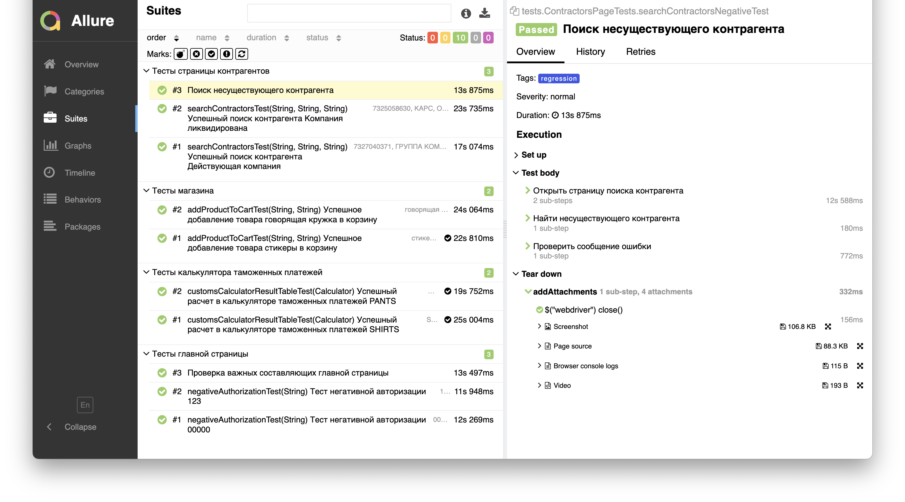
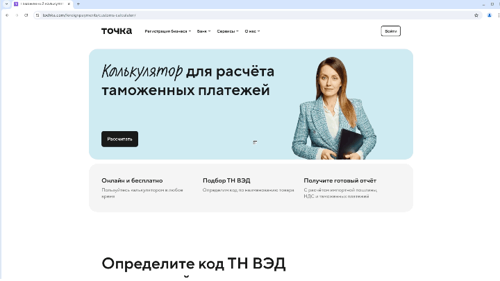

# Проект по автоматизации тестовых сценариев для <a href="https://tochka.com/"> Точка-Банк</a></h1>
****
## ☑️ Содержание:
- Использованные технологии и инструменты
    - Содержание Allure Report
- Запуск автотестов
    - Запуск тестов из терминала
    - Запуск тестов на удаленном браузере
    - Параметры сборки
- Визуализация
    - Сборка в Jenkins
    - Пример Allure Report
    - Интеграция с Allure TestOps
    - Интеграция с Jira
    - Уведомление в Telegram
    - Демо видео запуска тестов
****

## ☑️ Использованные технологии и инструменты

<p align="center">


</p>

- В данном проекте автотесты написаны на языке <code>Java</code> с использованием фреймворка для тестирования <code>Selenide</code>.
- В качестве сборщика был выбран - <code>Gradle</code>.
- Использован фреймворк модульного тестирования <code>JUnit 5</code>.
- При прогоне тестов запуск браузера происходит в <code>Selenoid</code>.
- Для удаленного запуска реализована джоба в <code>Jenkins</code> с формированием <code>Allure Report</code>.
- После завершения сборки, бот созданный в <code>Telegram</code>, автоматически обрабатывает и отправляет сообщение с результатом в специальную группу.
- Осуществлена интеграция с <code>Allure TestOps</code> и <code>Jira</code>

### Содержание Allure Report:
- Шаги теста;
- Скриншот страницы на последнем шаге;
- Page Source;
- Логи браузерной консоли;
- Видео выполнения автотеста.
****

## ☑️ Запуск автотестов
### Запуск тестов из терминала

```bash  
gradle clean regression_test
```
### Запуск тестов на удаленном браузере
```bash  
clean ${TASK}
-Dbrowser=${BROWSER}
-DbrowserSize=${BROWSER_SIZE}
-DbrowserVersion=${VERSION}
-Dremote=${REMOTE_SERVER}
```
### Параметры сборки:
- REMOTE_SERVER (адрес удаленного сервера Selenoid)
- BROWSER (браузер, по умолчанию chrome)
- VERSION (версия браузера, по умолчанию 126.0)
- BROWSER_SIZE (размер окна браузера, по умолчанию 1920x1080)
- TASK (набор кейсов для запуска, по умолчанию regression_test)
- BRANCH (ветка, на которой надо запустить тесты, по умолчанию master)
****

## ☑️ Визуализация
Ниже представлены скриншоты основных инструментов и процессов, используемых в ходе разработки и тестирования проекта.
<details>
  <summary>Сборка в Jenkins</summary>
<p align="center">

</p>
</details>

<details>
  <summary>Пример Allure Report</summary>

#### Превью

<p align="center">

</p>

#### Результат выполнения теста

<p align="center">

</p>

#### Графики

<p align="center">

</p>

</details>

<details>
  <summary>Интеграция с Allure TestOps</summary>
<p align="center">

</p>
</details>

<details>
  <summary>Интеграция с Jira</summary>
<p align="center">

</p>
</details>

<details>
  <summary>Уведомление в Telegram</summary>
<p align="center">

</p>
</details>

<details>
  <summary>Демо видео запуска тестов</summary>
<p align="center">
  
</p>
</details>

****